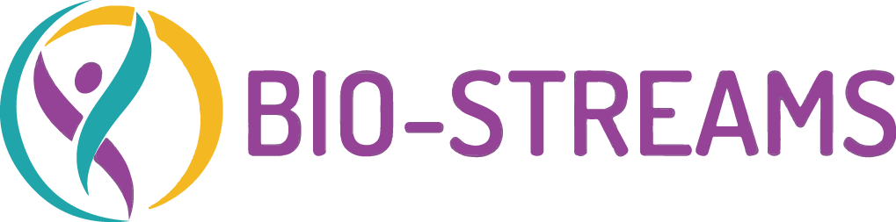

# Bio-Streams Project

Welcome to the **Bio-Streams** project, an EU-based initiative aimed at addressing underage obesity by leveraging health data and developing cross-sectoral solutions for prevention, research, and education.

## Project Scope

Bio-Streams tackles the alarming rise of childhood obesity across the EU. By creating the **Bio-Streams Biobank**, the project will serve as a scientific platform for the optimal use of health data (biological, demographic, epigenetic, etc.) to generate new evidence, methodologies, and tools. Key objectives include:

- Understanding the transition from metabolically healthy to unhealthy in children.
- Designing better strategies for weight self-management among youth.
- Coordinating policymakers and health authorities to develop solutions for health promotion and underage obesity prevention.
- Delivering transparent, robust methodologies for data handling, analysis, and reporting through meta-reviews, AI-based apps, and multi-site pilots in clinical and educational settings.

Bio-Streams will also provide **obesity prevention guidelines**, knowledge generation, and opportunities for collaboration with regional and national health authorities. 
This project is made possible with the collaboration of research institutions, clinical partners, schools, and policymakers dedicated to making a positive impact on childhood obesity.

## Key Links

- **Project Website:** [www.bio-streams.eu](http://www.bio-streams.eu)
- **Jenkins GUI:** [Jenkins Dashboard](http://jenkins.bio-streams.eu)

